# Інструкція для користувача DigiUniRegistry by Kolisnyk and Korotkov
## Для початку, трохи про саму програму:
DigiUni Registry — це комплексна консольна система управління університетським реєстром, створена мовою Java. Програма детально моделює реальну архітектуру навчального закладу (на прикладі НаУКМА) і призначена для автоматизації роботи деканатів та відділів кадрів.

Головна мета застосунку — забезпечення швидкого, безпечного та зручного керування ієрархією університету: від створення нових факультетів і кафедр до управління особистими картками студентів та викладачів.

## Запуск програми
* Для використання програми користувачу потрібно склонувати Git-репозиторій командою:
  `git clone https://github.com/Denys128112/Lab-DigiUni-Registry.git`
* Далі відкрити проєкт в **IntelliJ IDEA**:
    * Натиснути `Alt + \`
    * Натиснути **Open** та обрати клонований репозиторій
* Після чого скомпілювати проєкт, натиснувши на зелений знак **Play**:
  

## Вхід
* Після запуску програми вам буде запропоновано обрати роль:
  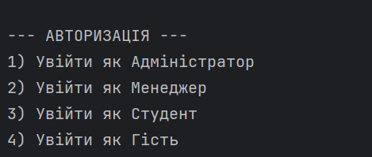
* Щоб обрати роль, треба натиснути цифру від 1 до 4. Нижче наведено опис можливостей кожної ролі:
    * Гість: має базовий доступ (лише перегляд загальних списків). 
    * Студент: має розширені права — додатково може користуватися системою пошуку та генерувати відсортовані звіти. 
    * Менеджер: має повний доступ до керування людьми (створення/редагування/видалення студентів та викладачів) і створення кафедр, але позбавлений права видаляти структуру університету (кафедри та факультети). 
    * Адміністратор: має абсолютний доступ до всього.

## Головне меню
* Після входу в програму вас зустріне головне меню:
  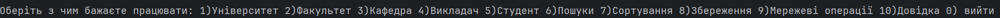
* Щоб обрати операцію, треба натиснути на відповідну клавішу на клавіатурі.

## Робота з сутностями
* У кожної сутності є 4 операції (крім Університету — його можна лише прочитати):
  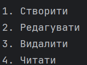
* Відповідно до вашої ролі вам будуть запропоновані відповідні операції. Нижче опис кожної з них:
    * **Створити:** дотримуючись простих інструкцій на екрані, вам треба ввести відповідні дані.
    * **Редагувати:** для кожної сутності ви можете відредагувати певну кількість полів.
    * **Видалити:** потрібно обрати сутність за ID або зі списку (для цього треба обрати 1 чи 2):
      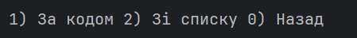
    * **Читати:** показати повний список певної сутності.

## Пошуки
* Натиснувши цифру **6**, ви побачите перед собою:
  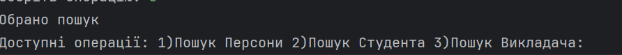
* Спочатку треба обрати сутність для пошуку (Персона — це і вчителі, і студенти).
* Після чого з'являться опції пошуку:
    * Для персон і вчителів: 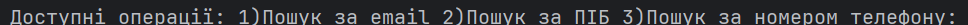
    * Для студентів: 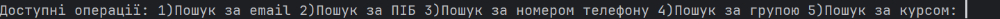
* Вам потрібно обрати пошук, що вас цікавить, і натиснути відповідну клавішу.
* Після чого введіть запит, за яким система знайде або не знайде обрану сутність і виведе результат на екран.

## Робота з сортуванням і фільтрацією
* Натиснувши цифру **7**, ви побачите перед собою:
  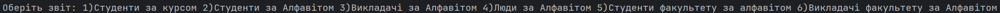
  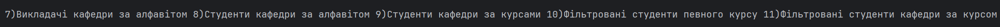
* Після вибору відповідної опції існує три варіанти подальшої дії:
    1. Для опцій **1, 2, 3, 4** одразу видно результат.
    2. Для опцій **5, 6, 7, 8, 9** треба обрати відповідну кафедру чи факультет (як при видаленні).
    3. Для опції **10** треба ввести бажаний курс, за яким йде фільтрація, а для опції **11** — ще й обрати потрібну кафедру.
* Після цього буде виведено список-результат відповідно до вашого вибору.

## Збереження
* Натиснувши кнопку **8**, ви можете зберегти весь результат вашої роботи. (Але не бійтеся: якщо програма раптово завершить роботу, тимчасові файли збережуться у фоні, і ви зможете відновити дані в наступній сесії).

## Мережеве з'єднання
* Натиснувши кнопку **9**, ви зможете поділитися файлами з іншими користувачами або ж отримати їх, якщо хтось інший їх роздає:
  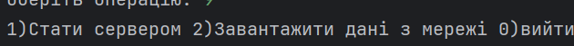
* Для того, щоб стати сервером, натисніть **1**; для того, щоб отримати потрібні дані з мережі, натисніть **2**.

## Довідка
* Натиснувши **10**, ви отримаєте довідку про методи нашого меню:
  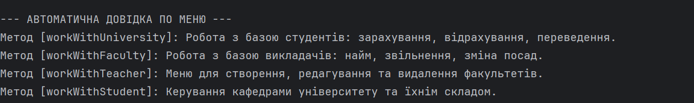

## Завершення
* Для коректного завершення програми натисніть **0** в головному меню.
* Вам буде запропоновано або зберегти зміни, або ні:
  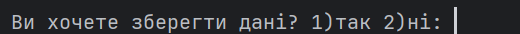

## Опис клсів:
#### Базовий пакет (CLI - Логіка та Інтерфейс)
- ConsoleProgram — Головний "пульт керування" програмою. Відображає головне меню, обробляє авторизацію та перенаправляє користувача до потрібних функцій залежно від його прав доступу.

- CRUDoperations — Управління даними. Тут зібрана логіка для Створення (Create), Читання (Read), Оновлення (Update) та Видалення (Delete) факультетів, кафедр, студентів та викладачів.

- InputHelper — Допоміжний клас для перевірки. Він містить безпечні методи зчитування чисел та тексту, щоб програма не ламалась, якщо користувач випадково введе літеру замість цифри.

- Reportoperations — Генератор звітів. Використовує Stream API для сортування списків людей (за алфавітом чи курсом) та їх фільтрації.

- Repository — База даних у пам'яті для зберігання всіх існуючих студентів та викладачів.

- Searching — Клас із алгоритмами пошуку. Містить логіку пошуку потрібних об'єктів у колекціях (за ID, ПІБ, email тощо).

- SearchOperations — Клас для взаємодії з користувачем під час пошуку (запитує, що саме шукати, і викликає відповідні методи з Searching).

- UniversityRepository — Окреме сховище, яке тримає в собі структуру університету: самі факультети та їхні кафедри.

#### Пакет DigiPackage (Сутності та метадані)
- AcademicTitle — Перерахування можливих вчених звань викладача (Доцент, Професор тощо).

- Department — Сутність кафедри. Зберігає інформацію про прив'язаних до неї студентів та викладачів, а також знає, хто нею завідує.

- Faculty — Сутність факультету. Керує списком своїх кафедр і містить інформацію про декана.

- FormOfStudy — Форми навчання (Бюджет, Контракт).

- MenuOption — Власна кастомна анотація (@interface), створена для позначення методів меню, щоб їх міг знаходити Reflection API для генерації довідки.

- Person — Абстрактний батьківський клас. Зберігає спільні для всіх людей дані: ПІБ, дату народження, номер телефону та email.

- Position — Посади викладача (Асистент, Лектор, Декан тощо).

- ScientificDegree — Наукові ступені (Кандидат наук, Доктор наук тощо).

- Status — Академічний статус студента (Навчається, В академвідпустці, Відрахований).

- Student — Клас студента, що розширює Person. Додає специфічні дані: курс, групу, номер заліковки та форму навчання.

- Teacher — Клас викладача, що розширює Person. Зберігає дані про ставку, робоче навантаження та посади.

- University — Клас для загальної інформації про сам університет (НаУКМА, Київ, адреса).

- UserRole — Перерахування ролей доступу (GUEST, STUDENT, MANAGER, ADMIN) з побітовими масками для перевірки прав.

- UserSession — Java record, який компактно і безпечно зберігає дані про поточного авторизованого користувача та час його входу.

#### Пакет exceptions (Власні помилки)
- EmptySearchResultException — Викидається системою, якщо пошук по базі не дав жодного результату.

- EntityAlreadyExistsException — Спрацьовує як захист від створення дублікатів (наприклад, двох студентів з однаковим ID).

- ValidatingException — Головний запобіжник при введенні даних. Викидається, якщо введено нереалістичну дату народження, поганий формат email чи неіснуючий вік.

#### Пакет network (Мережева взаємодія)
- Client — Відповідає за підключення до сервера через TCP-сокет і завантаження бази даних Json.

- Server — Перетворює програму на сервер, який слухає порт і роздає поточний стан бази даних тим, хто підключиться.

#### Пакет org.example
- Main — Початковий клас.
 #### Пакет saving (Робота з файлами)
- SaveOperations — Клас для серіалізації/десеріалізації. Відповідає за перетворення об'єктів у Json, збереження їх на диск та створення фонових резервних копій (temp-файлів) кожні 3 хвилини.

### Тести (test)
- AuthTest — Файл з JUnit-тестами, який перевіряє виключно логіку безпеки: чи правильно працюють побітові маски, чи має Менеджер правильні доступи, і чи блокується несанкціонований доступ Гостя.
- CLITest - Файл з JUnit-тестами, який заточений на загальну перевірку правильної роботи програми.

